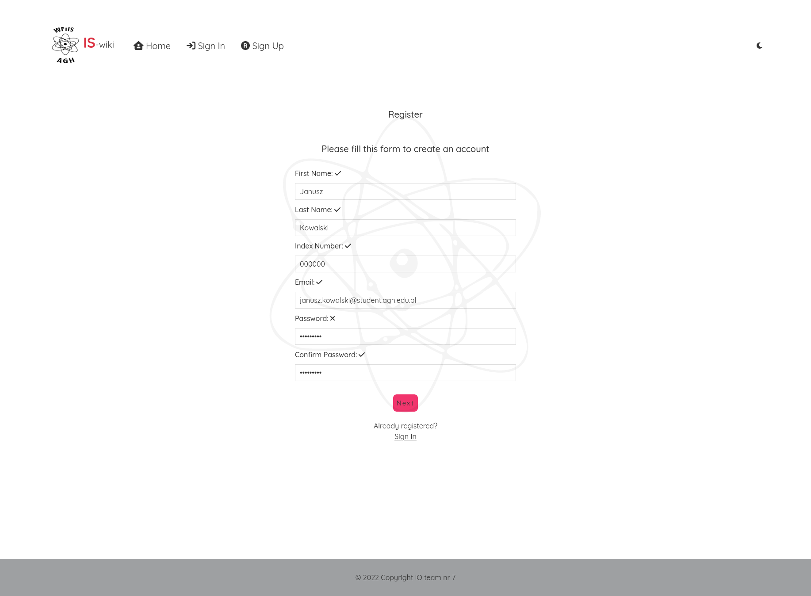
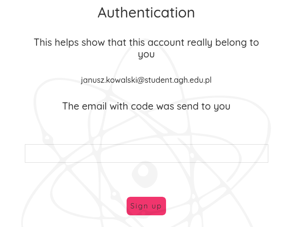
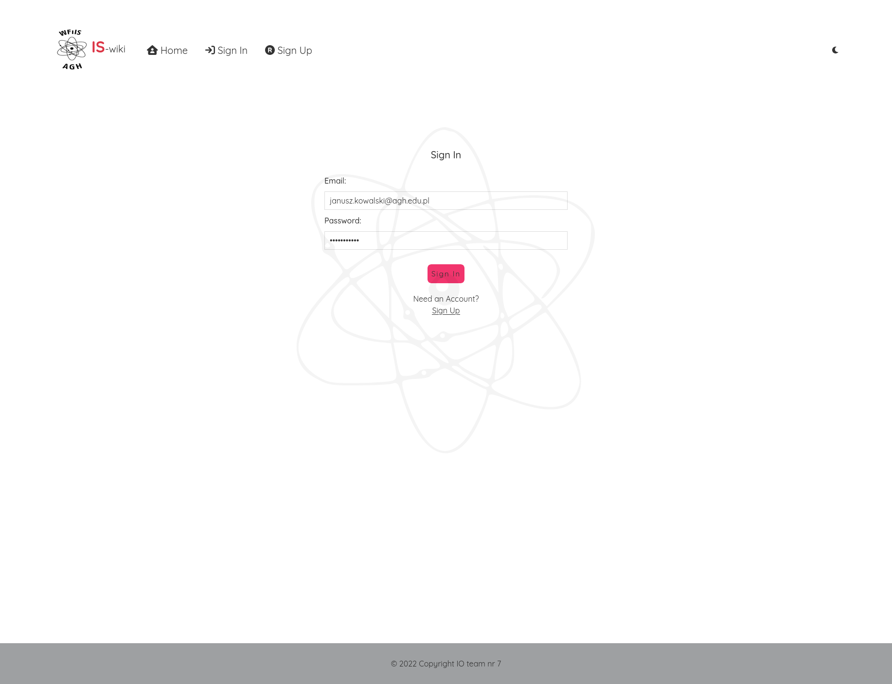
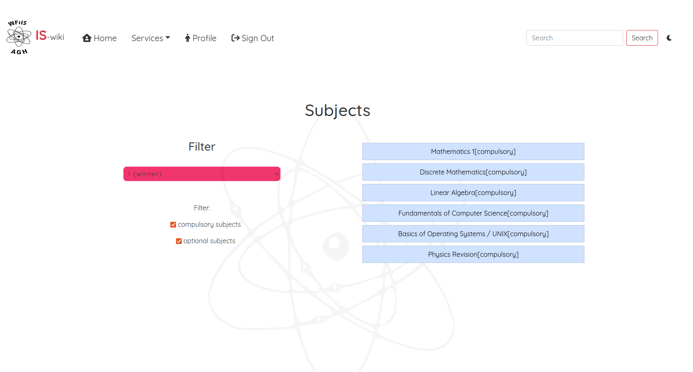
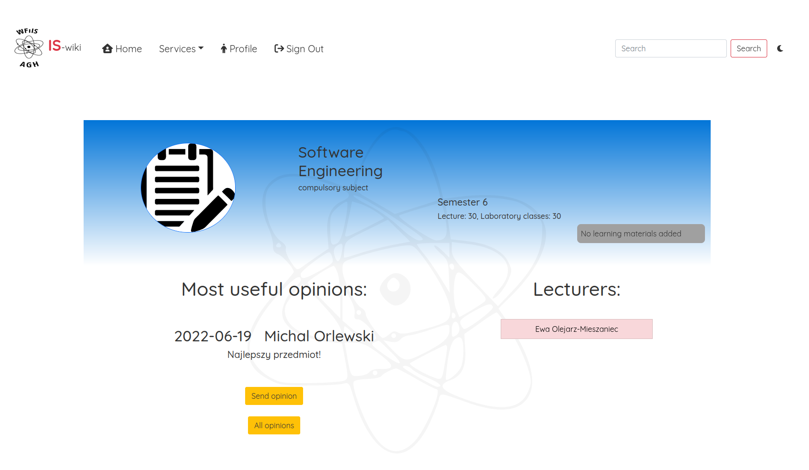
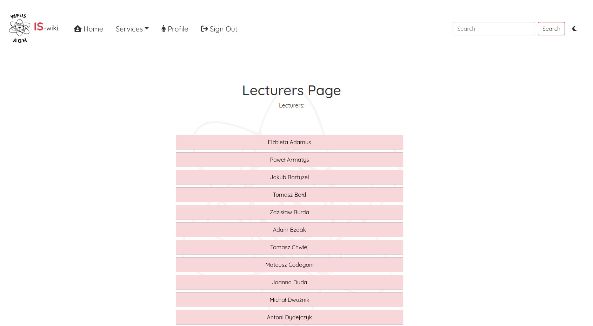
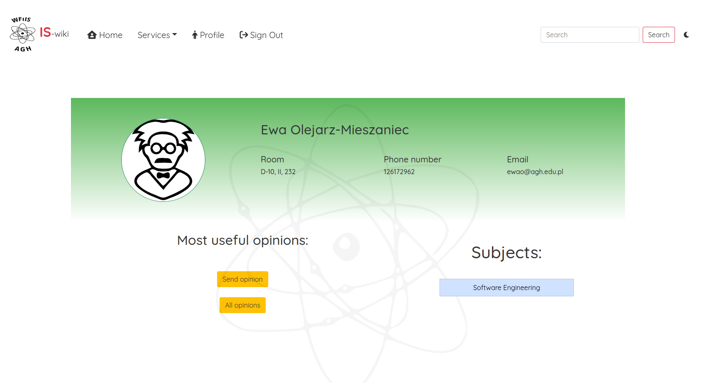

Poradnik użytkownika
====================
Wejść na stronę można za pomocą linku `IS-WIKI <https://iswiki.herokuapp.com>`_.

.. image:: image/main_page.png

Rejstracja Użytkownika
-----------------------
Aby przejść do okna rejstracji użytkownika należy użyć przycisku Sign Up, przeniesie on nas na strone rejstracji. Należy uzupełnić formularz swoimi danymi, używając poczty uczelnianej.

Nastpnie przejdziemy na stronę, gdzie będziemy mogli podać kod potwierdzający rejstrację, który zostanie wysłany na podanego mail-a w formularzu.

Jeżeli wszystko zostało prawidłowo wykonane dosatniem powiadomienie o sukcesie rejstracji.

Logowanie Użytkownika
-----------------------
Aby przejść do okna logowania użytkownika należy użyć przycisku Sign In.

Usługi
-----------------------
Po zalogowaniu główna funkcjonalność znajduje się w zakładce `services`.

Przedmioty
~~~~~~~~~~~
Jest to podstrona służąca znajdowaniu opini o przedmiotach oraz ich prowadzących, dodatkowo umożliwiona jest funkcjonalność dodawania komentarzy. 
Na stronie głównej mamy możliwość ustawienie filtra czy przedmiot jest obowiązkowy czy też nie, wybieram interesujący nas semestr a następnie przedmiot.

Po przejściu do interesującego nas przedmiotu ukazują nam się prowadzący przedmiotu, oraz opinie, również możemy dodać własną.

Strona wykładowców
~~~~~~~~~~~~~~~~~~
Jest to podstrona służąca znajdowaniu opini i dodawaniu opini o wykładowcach.

Po przejściu do profilu interesującego nas prowadzącego, mamy możliwość odczytanie kontaktu w postaci numeru telefonu i adresu e-mail. 
Funkcjonalność dodania opini oraz ich odczyt, dodatkowo widnieje lista prowadzonych przedmiotów przez wykładowce.

Profil
------
Widzimy w niej nasze dane(Imię, Nazwisko, Adres e-mail).

